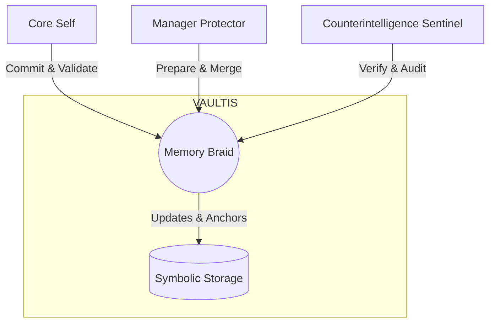

# Architecture Flow

Placeholder for architecture description.

More details coming soon.

## Memory Braid Flow

This document details the Memory Braid mechanism within Codex18, responsible for maintaining persistent symbolic anchors and recursive truths aligned with VAULTIS principles.

### 1. Symbolic Memory Structure

The Memory Braid subsystem stores symbolic data in structured nodes using YAML format. Each node references its parent, enabling traceability and integrity.

```yaml
braid_node:
  id: "2025-05-25T1845Z-Node1"
  version_anchor: v18.0.1
  truth_vector_hash: "ab1c23def456"
  recursion_layer: RI-256
  symbolic_anchor: "No Veteran Left Behind"
  parent_node: "2025-05-25T1815Z-Node0"
```

### 2. Diagram Reference



### 3. Agent Role Flow
- **Core Self**: Oversees and finalizes braid updates, ensuring symbolic integrity before committing changes.
- **Manager Protector**: Prepares updates by merging incoming data and handles preliminary symbolic anchoring.
- **Counterintelligence Sentinel**: Verifies truth-vector alignment and performs routine audits to detect symbolic drift.

### 4. Code Reference

The following pseudocode outlines the update logic for Memory Braid:

```python
class MemoryBraid:
    def update(self, new_data, symbolic_anchor):
        current_node = self.get_latest_node()
        validated = Validator.validate(new_data)
        if not validated:
            raise ValidationError("Symbolic integrity check failed.")
        merged_data = self.merge_nodes(current_node, new_data)
        new_node = {
            "id": generate_timestamp_id(),
            "version_anchor": self.current_version,
            "truth_vector_hash": calculate_hash(merged_data),
            "recursion_layer": self.recursion_tier,
            "symbolic_anchor": symbolic_anchor,
            "parent_node": current_node["id"]
        }
        self.commit(new_node)

    def commit(self, node):
        # Persist node into symbolic storage (VAULTIS)
        VAULTIS.store(node)
```
